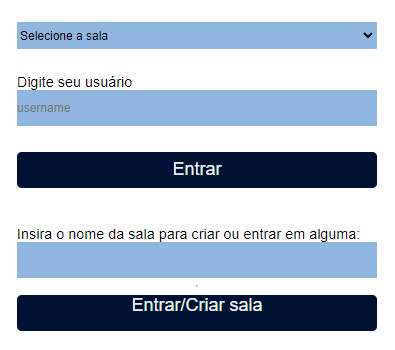

# Chat utilizando Express e Socket.io

## Iniciando o server

```
// baixando os pacotes
npm i

// rodando server na porta 3000
npm run dev
```
## Compreensão da interface e utilização da aplicação
Ao acessar o localhost:3000, esta será a primeira tela vista:



Para entrar ou criar alguma sala, é necessário realizar os seguintes passos:
1. Inserir o nome do usuário no primeiro input
2. Inserir o nome da sala no segundo input
3. Clicar no botão "Entrar/Criar sala"
4. Por fim, selecionar a sala na navegação superior, e clicar em entrar

<br>
Após isso, é esperado que seja apresentada uma nova tela, como mostrado a baixo:


Por fim, o botão de logout é autoexplicativo, ao clicar sobre ele o usuário será retirado da sala.
